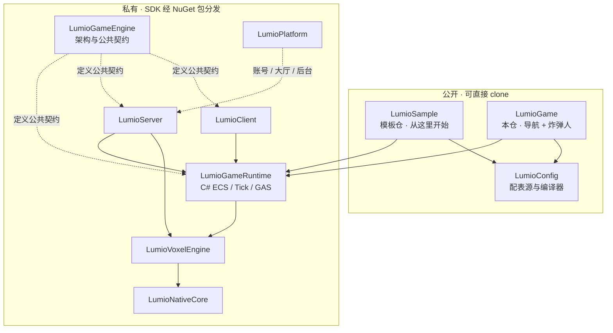

# LumioGame

> **LumioGames 组织的导航入口** —— 想知道该 clone 哪个仓，看这里就够了。
> 本仓同时是**炸弹人**游戏产品的 Gameplay、内容与发布语义事实源；导航与产品暂时同仓，是过渡态。

## 五分钟上手

第一次接触 Lumio，**不要从本仓开始** —— 从模板仓 [`LumioSample`](https://github.com/LumioGames/LumioSample) 开始。它是引擎的参考实现，也是新游戏的模板：

```bash
gh repo create my-game --template LumioGames/LumioSample --public --clone
```

没装 [`gh`](https://cli.github.com/) 就直接 clone 模板：

```bash
git clone https://github.com/LumioGames/LumioSample.git
```

想一次拉齐全部公开仓（落到脚本所在仓的同级目录）：

```bash
git clone https://github.com/LumioGames/LumioGame.git
node LumioGame/clone-all.mjs
```

私有仓拉不到也不需要 —— 脚本打印「跳过（无权限）」后正常结束，它们的 SDK 经 NuGet 包分发。有权限的内部开发者加 `--include-private`。

## 产品拓扑



箭头是依赖方向：上层消费下层。公开仓不依赖任何私有仓的源码 —— 引擎能力一律经 NuGet 包消费。

## 仓库导航

| 仓库 | 可见性 | 一句话 |
| --- | --- | --- |
| [`LumioSample`](https://github.com/LumioGames/LumioSample) | 公开 | 游戏「示例」：引擎参考实现，也是新游戏的模板仓 —— **外部开发者从这里开始** |
| [`LumioGame`](https://github.com/LumioGames/LumioGame) | 公开 | 本仓：组织导航，以及炸弹人游戏产品的 Gameplay、配置、内容与发布语义 |
| [`LumioConfig`](https://github.com/LumioGames/LumioConfig) | 公开 | Schema-first 配表源、编译器与导出工具 |
| [`LumioAgentSpec`](https://github.com/LumioGames/LumioAgentSpec) | 公开 | 开发项目管理 Agent 框架：调度、对抗审查、常驻规则 |
| [`workflow-plugin`](https://github.com/LumioGames/workflow-plugin) | 公开 | 把 Claude Code / Cursor / Codex 接到 Workflow 的插件 |
| `LumioGameEngine` | 私有 | 架构与公共契约的唯一事实源 |
| `LumioGameRuntime` | 私有 | C# ECS、Tick、GAS 与 Gameplay 热重载宿主 |
| `LumioServer` | 私有 | Rust 专用服务器宿主、网络与 CoreCLR 托管 |
| `LumioClient` | 私有 | 引擎无关的 C# 客户端运行时、复制与预测 |
| `LumioVoxelEngine` | 私有 | Rust 体素引擎 |
| `LumioNativeCore` | 私有 | Rust 原生底座与版本化 native 契约 |
| `LumioPlatform` | 私有 | 账号权威、大厅、反馈与运营后台 |

私有仓不对外开放源码；开发游戏所需的引擎能力全部经 **NuGet 包**分发，不需要它们的源码检出。

<!-- lumio-community:start -->
<div align="center">
<table>
<tr>
<td align="center" width="50%" valign="top">
<a href="https://qm.qq.com/q/PGkXh4tCyQ"></a><br>
<a href="https://qm.qq.com/q/PGkXh4tCyQ"></a><br>
<sub>什么都能聊</sub>
</td>
<td align="center" width="50%" valign="top">
<a href="https://applink.feishu.cn/client/chat/chatter/add_by_link?link_token=b24vf257-5a2b-41ce-935e-bc4ce19dc396"></a><br>
<a href="https://applink.feishu.cn/client/chat/chatter/add_by_link?link_token=b24vf257-5a2b-41ce-935e-bc4ce19dc396"></a><br>
<sub>飞书话题群 · 玩法、内容、发布</sub>
</td>
</tr>
</table>
<sub>先进群再看代码。其它群和整体介绍见 <a href="https://github.com/LumioGames">LumioGames 主页</a>。</sub>
</div>
<!-- lumio-community:end -->

---

以下是**本仓作为炸弹人游戏产品**的说明。

## 契约来源

本仓处于预上线 Living Architecture 阶段，不发布或复制冻结基线。公共语义（ABI、线上契约、依赖方向）的唯一事实源是架构仓 `LumioGameEngine`，本仓只消费、不复制，也不保存镜像；本仓文档只写「在炸弹人里这条契约怎么用」。公共语义要改，先在架构仓改，不在本仓自行改写。

内部贡献者查具体字段、错误码与消息 ID 的入口见 [`.spec/knowledge/standards/repository-architecture.md`](.spec/knowledge/standards/repository-architecture.md)。

`LumioGame` 位于依赖图最上层，把 Runtime、Server、Client 和玩法内容组合成具体游戏，产出同一 `ProductId + GameReleaseId` 下的 Gameplay、配置、内容、Scenario 与 Migration。

本仓库拥有玩法语义，不拥有 Native、Voxel 内部、网络连接、Host 进程或 Runtime 生命周期。

## 拥有的状态与生命周期

- Server Gameplay 的权威 Component、Processor、GAS Content、经济、玩法事件。
- Client Gameplay 的 Replica、Prediction/Presentation Component 和输入映射。
- Config/Content/Scenario/Replay Fixture 与语义 Migration。
- GameWorld/客户端 World 的初始化、注册、快照投影和销毁 Hook；不拥有宿主状态机。

## 子模块

| 子模块 | 责任 | 状态 |
| --- | --- | --- |
| `modules/server-gameplay` | 权威 Component、Processor、Chat 系统与炸弹人 Stage 0 契约壳 | 已建 |
| `modules/config` | 源配表、Schema、默认值和 typed table 输入 | 骨架 |
| `modules/scenario` | 初始状态、输入、Bot、断言、Capability 要求 | 骨架 |
| `integration/` | 端到端集成验收工具（`hello`） | 已建 |

尚未建立的子模块不在本表中；需要时按 [`docs/specs/engineering/module-scaffolding-design.md`](docs/specs/engineering/module-scaffolding-design.md) 逐个立卡新建。

## 职责

- 定义 Server/Client 非对称 Component、Processor、RPC Payload 和权限语义。
- 通过 Runtime API 实现具体 GAS Content、公式、Targeting、资源消耗、Cooldown 和表现事件。
- 经引擎体素的批量读写访问地形，不访问 Voxel Storage、不保存第二份地形真值。
- 定义 Scenario、Bot 行为、Replay Fixture、性能 Workload 和业务断言。
- 提供 Game Migration、Save/Load 语义、Config/Content Hash 和签名输入。
- 声明每个 Scenario 的 `RequiredCapabilities`，避免假设所有 Host 都具备 Native、Renderer 或网络。

## 明确不负责什么

- 不实现 ECS Storage、Tick Scheduler、GAS 通用生命周期、Prediction/Rollback 机制或 Runtime Hot Reload。
- 不创建/销毁 Host、WorldSlot、CoreCLR、ALC、Socket、Connection 或 Release Pool。
- 不实现 Voxel Chunk、Revision、Streaming、Mesh 或 Native ABI。
- 不把 Server/Client 强制做成同名 Component 或同一份 World。
- 不在 Gameplay 中读取 `IsOffline`、平台或 Transport 实现来分叉规则。
- 不在本仓定义或复制公共契约；公共语义只在架构仓维护。
- V1 不加载第三方 Mod；Mod 仅保留 P2 受控扩展位置。

## Gameplay 与 World 边界

Server GameWorld 是 Gameplay/ECS/GAS 权威域；VoxelWorld 是引擎体素权威域；客户端 World 是投影和预测域。地形经引擎体素的帧初批量读、帧末一批写访问；玩法系统经 Tick 相位注册进 `WorldManager.Tick()` 唯一路径；移动与放弹是实体上的 GAS Ability。本仓不直接跨 World 读写、不保存第二份 Voxel 真相。

## GAS Content

Game 只定义具体内容和产品语义：Ability/Effect/AttributeSet/Tag、Formula、Targeting、Cost、Cooldown、权限和表现事件。Runtime 负责生命周期、Handle、Stack、PredictionFrame、Snapshot/Restore 和确定性；Server 负责权威验证，Client 负责输入和表现策略。复杂 Trigger Graph、Formula VM 和跨 Ability 求解器列为 P2。

## 配置、内容与存档

- 人类可读配表经 Schema 校验和编译，运行时只消费 typed binary table。
- 每个 Tick 使用不可变快照，开发可热载，生产显式版本切换。
- Content/Config/Gameplay Snapshot 带版本、Length、Hash/Checksum 和签名元数据；读取路径必须先校验元数据再反序列化，失败不得激活半成品。
- Singleplayer 与 Dedicated Server 在同一 Release 使用可移植 Save/Snapshot；跨版本由本仓库提供 Migrator。
- Migrator 在不可变 Snapshot 的 Staging 副本上运行，完成引用/资源上限校验后才原子激活，失败保留旧数据。

## 日志与观测

定义 Gameplay Diagnostic、Audit、Economy/Permission Audit、Scenario Assertion 和业务 Trace Event；Host 提供成熟框架的异步 Sink。Gameplay 不直接写文件或阻塞 Simulation Thread。事件字段口径以架构仓的公共契约为准，本仓不复述。

## Source / Compile-Time Dependencies

- `LumioGameRuntime`（私有，SDK 经 NuGet 包分发）：稳定 ECS、Tick、GAS、Coordinator、Replication、Persistence 和 Config API。
- `LumioServer`/`LumioClient`（私有，SDK 经 NuGet 包分发）：只引用公开 Host/Adapter Contract，不依赖实现源码。
- .NET SDK、C# 编译器和经过许可证/SBOM/漏洞/AOT/确定性/性能审查的包。

业务代码禁止对 NativeCore/VoxelEngine 源码建立 Compile-Time 依赖。

内部贡献者的跨仓检出与本地构建口径见 [`.spec/knowledge/standards/repository-architecture.md`](.spec/knowledge/standards/repository-architecture.md)「跨仓检出」，构建与测试命令见 [`.spec/AGENTS.md`](.spec/AGENTS.md)「收口门槛」。

## Headless Test Surface

- Component/权限、GAS Content、Scenario 初始状态和业务断言。
- 炸弹人 Stage 0 的传播、连锁、血量、帽子、拾取、地图与回放用例（见 [`docs/specs/bomber/stage0-test-matrix.md`](docs/specs/bomber/stage0-test-matrix.md)）。
- Replay 首差异、Save/Load/Migration Golden。
- Config Schema/优先级/快照、Content Hash 与握手拒绝。
- 日志/审计关联、Failure Bundle、100 Bot Workload、Tick/复制/内存指标。

## 开源优先与供应链

优先采用成熟开源的 Schema、序列化、日志、测试和工具框架；通过 Adapter 隔离并锁定版本/Commit。默认优先 MIT、Apache-2.0、BSD、Zlib；强传染许可证需法务审核。Game 仍负责验证产品语义、数据迁移和内容安全。

## 开发规范

- 新玩法先写 Scenario、失败路径和 Replay 断言，再接入表现。
- 地形只经引擎体素批量读写；所有网络输入经公共契约和权限校验。
- 任何保存/迁移都必须有旧版本 Fixture、校验、失败保留和可回放证据。
- 不把产品规则下沉到 Runtime、Server、Voxel 或 NativeCore。
- 详细规范见 [`.spec/knowledge/README.md`](.spec/knowledge/README.md) 导航。

## 当前阶段与开发节奏

当前阶段是**炸弹人 Stage 0**（首发产品，阶梯 ①）。切片划分、每阶段的量化通过门与依赖见 [`docs/specs/bomber/design.md`](docs/specs/bomber/design.md) §16「实现切片：Gate 0 + Stage 0–6」：

1. **Stage 0a · 杀手原型（headless）**：19×19 灰盒、移动与放弹、连锁与结算、三心血量与重生、三糖果、击杀铸帽与帽王判定、8 Bot、Config 表与遥测。过确定性门、规则门、稳定性门。
2. **Stage 0b · 杀手原型（浏览器）**：浏览器客户端接 0a，过玩法门。
3. **Stage 1 及以后**：8 人产品纵切 → 地图与 24/48 人 → 100 Bot 性能门 → 完整官方 MVP → 装备切片 → 硬化与候选发布。

Stage 0 的内核契约见 [`docs/specs/bomber/stage0-kernel-contract.md`](docs/specs/bomber/stage0-kernel-contract.md)。

## 许可证

本仓库是 **Demo / 示例仓库**，采用 **Apache License 2.0** —— 见 [LICENSE](LICENSE)。
你可以自由 fork、修改、二次创作，并用它开发和商业运营你自己的游戏，无需额外授权。

> ⚠️ **引擎本体不在本许可证范围内。** 本仓库所依赖的 Lumio 引擎（`Lumio.Engine.*`、`Lumio.GameRuntime.*` 等）单独采用 **Business Source License 1.1（BUSL-1.1）**，条款独立于本仓库：
>
> - ✅ 允许：用它开发、发行、商业运营你自己的游戏与游戏内容
> - ❌ 不允许：用它对外提供游戏引擎、游戏开发套件、运行时、服务端框架等与之竞争的面向开发者的产品或服务
> - 2030-09-07 自动转为 Apache License 2.0
>
> 完整条款见引擎分发物随附的 LICENSE 文件。
